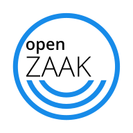

# OpenZaak

> Stage 2: incubation

## What it is

OpenZaak is a case management platform for municipalities that want to deliver citizen-friendly services online.

It is a ready-to-use backend solution that acts as a directory of case registration, including metadata describing the case.

OpenZaak implements the [Dutch national API standards for case management](https://www.vngrealisatie.nl/producten/api-standaarden-zaakgericht-werken), developed by the Dutch Association of Municipalities (VNG).

## How we're helping

We're helping launch the OpenZaak open source ecosystem by:

* running a [market consultation](https://github.com/open-zaak/open-zaak-market-consultation/blob/develop/README.md) to co-create codebase governance and community dynamics, and better understand vendor business models and risk sharing
* advising on decentralized procurement
* building the community through shared events, a mailing list and marketing materials

## Technology

Languages and frameworks: Python

## Community

Created by: a coalition of more than 45 Dutch municipalities including Amsterdam, Arnhem, Delft, Haarlem, ’s-Hertogenbosch, Rotterdam, Tilburg, Hoorn, Medemblik, Utrecht, SED (composed of Stede Broec, Enkhuizen and Drechterland) and [Dimpact](https://www.dimpact.nl/) (composed of more than 30 municipalities) (2019)

Replicating: The commissioning municipalities are preparing to procure services using OpenZaak, based on their spring 2020 market consultation

## Opportunity

Scaling potential: other Dutch municipalities, other industries that use a case management system (like hospitals or hotels)

We're working closely with the commissioning municipalities to help them grow OpenZaak to a trusted codebase with:

* many vendors offering a range of services using OpenZaak
* widespread adoption by municipalities

OpenZaak maintainers see meeting the [Standard for Public Code](https://standard.publiccode.net/) as integral to achieving their vision.

## Find out more

* [Github repo](https://github.com/open-zaak/open-zaak)
* [OpenZaak product website](https://openzaak.org/)
