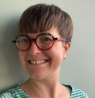

# Our staff

We're a multidisciplinary team with years of experience in government digital transformation, open source and building collaborative networks. [Read more about how roles are structured](https://about.publiccode.net/organization/staff.html).

[Ben Cerveny](ben-bio.md), President

Boris van Hoytema, Chief executive

Claus Mullie, Codebase stewardship and member relations coordinator

[Elena Findley-de Regt](elena-bio.md), Communications coordinator

[Eric Herman](eric-bio.md), Lead codebase steward

[Jan Ainali](jan-bio.md), Codebase steward

Mirjam van Tiel, Value and finances lead
