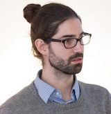
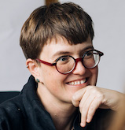
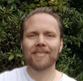

# Our staff

We're a multidisciplinary team with years of experience in government digital transformation, open source and building collaborative networks.

[Ben Cerveny](ben-bio.md), President

[Boris van Hoytema](boris-bio.md), Chief executive

[Claus Mullie](claus-bio.md), Codebase stewardship and member relations coordinator

[Elena Findley-de Regt](elena-bio.md), Communications coordinator

[Eric Herman](eric-bio.md), Lead codebase steward

[Jan Ainali](jan-bio.md), Codebase steward

[Read more about how roles are structured](https://about.publiccode.net/organization/staff.html), or [come work with us!](../careers/index.md).
