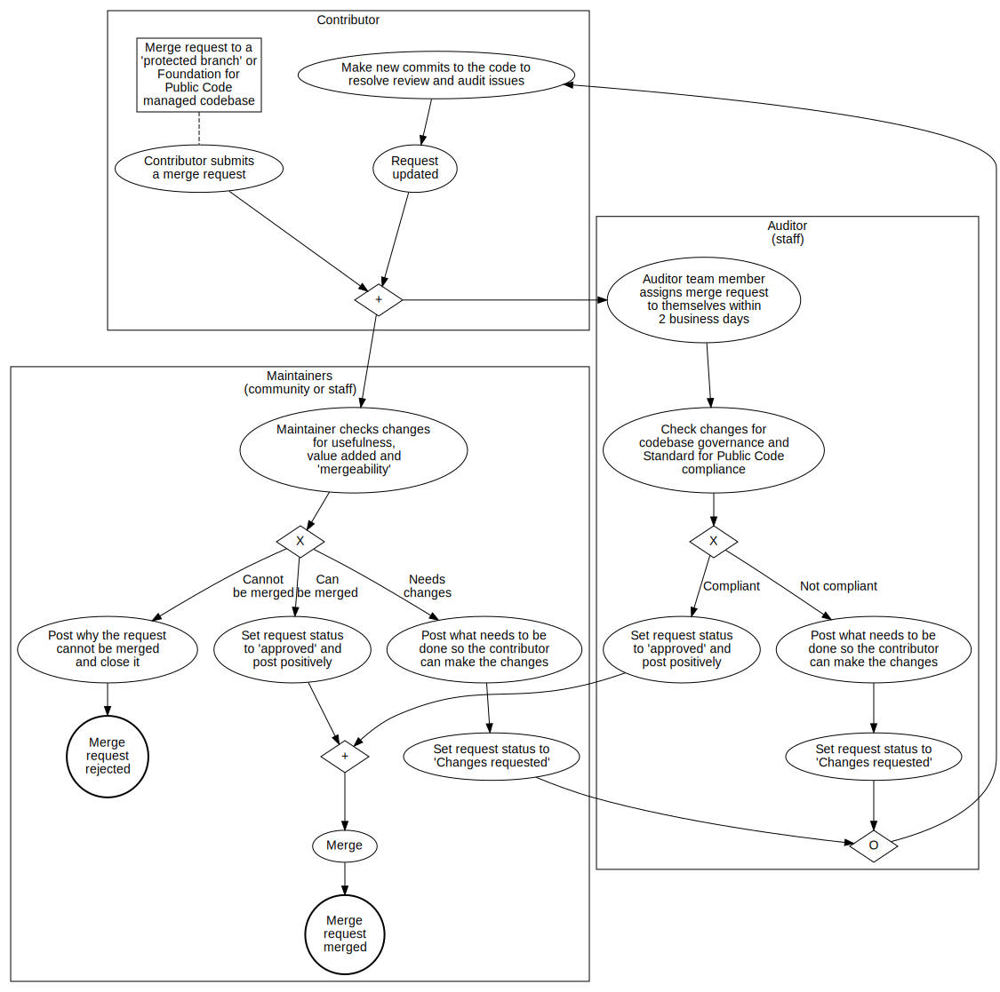

# Standard compliance and certification process

<!-- SPDX-License-Identifier: CC0-1.0 -->
<!-- SPDX-FileCopyrightText: 2021-2023 The Foundation for Public Code <info@publiccode.net> -->

The Foundation for Public Code can audit your codebase and community to verify if you are compliant with the Standard for Public Code.
This makes clear to potential users and contributors that the codebase is of high quality, and updates will be too.

The audit performed by the Foundation for Public Code is meant to complement machine testing, as machines are great at testing things like syntax and whether outcomes align with expectations.
Things meant for humans are impossible for machines to test, like whether documentation is actually understandable and accessible in context, the commit messages make sense, and community guidelines are being followed.

The audit tests the entire codebase, including source code, policy, documentation and conversation for compliance with both the standards set out by the Foundation for Public Code and the standards set out in the codebase itself.

Codebases that are fully compliant with the Standard for Public Code are listed at [standard-compliant.publiccode.net](https://standard-compliant.publiccode.net/).

[See the full stewardship lifecycle.](https://about.publiccode.net/activities/codebase-stewardship/lifecycle-diagram.html)

## How the process works

Every time a contribution is suggested to a codebase, for example through a merge request, the [codebase stewards](https://about.publiccode.net/roles/) of the Foundation for Public Code will audit the contribution for compliance with the Standard for Public Code.
New contributions can only be adopted into the codebase after they have been approved as compliant with the Standard for Public Code, and have been reviewed by another contributor.

The audit is presented as a review of the contribution.
The codebase steward gives line by line feedback and compliance, helping the contributor to improve their contribution.
The merge request cannot be fulfilled until the codebase stewards have approved the contribution.

## Certifying an entire codebase versus a contribution

For the codebase to be completely certified every meaningful line of code, and the commits behind the code, need to meet the Standard.

If codebases have been completely audited from the first merge request they can be immediately certified as compliant with the Standard for Public Code.

If the audit process is added to an existing codebase, the new merge requests can be certified, but the existing code will not be automatically certified.
By auditing every new merge request the codebase can move incrementally towards being completely certified.
The codebase stewards can also do a complete audit of a codebase, at the current commit, and start applying the process from then on to ensure that a codebase stays certified.
